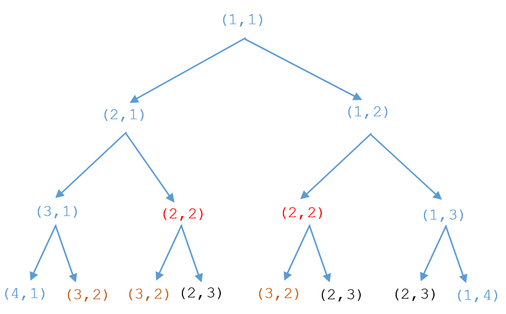
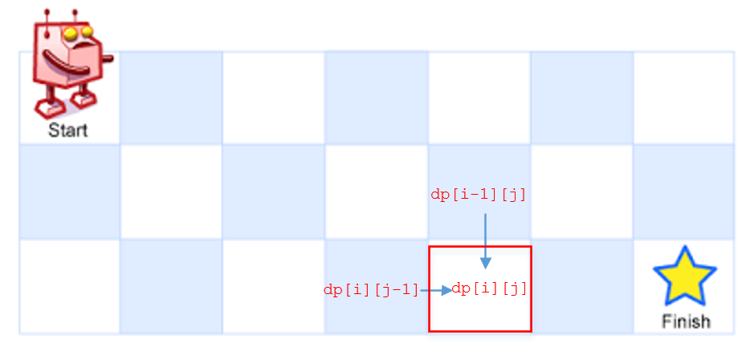
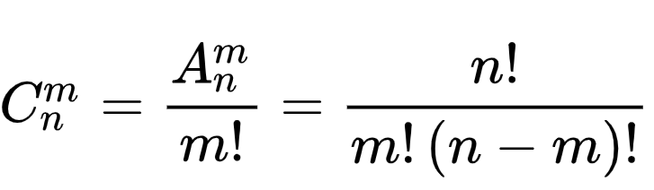

62 不同路径

[https://leetcode-cn.com/problems/unique-paths](https://leetcode-cn.com/problems/unique-paths)

解题思路：

1、 暴力拆解：
用函数递归计算路径，将所有递归路径总和相加得到。
```c++
public int uniquePaths(int m, int n) {
    return uniquePathsHelper(1, 1, m, n);
}

//第i行第j列到第m行第n列共有多少种路径
public int uniquePathsHelper(int i, int j, int m, int n) {
    //边界条件的判断
    if (i > m || j > n)
        return 0;
    if ((i == m && j == n))
        return 1;
    //从右边走有多少条路径
    int right = uniquePathsHelper(i + 1, j, m, n);
    //从下边走有多少条路径
    int down = uniquePathsHelper(i, j + 1, m, n);
    //返回总的路径
    return right + down;
}
```

    1.1、 暴力拆解的优化
由于很多运算结果是重复的(参考下图)，可以建立一个哈希树将结果存储下来，下次在函数中直接获取，达到剪枝的效果。


```c++
public int uniquePaths(int m, int n) {
    return uniquePathsHelper(1, 1, m, n, new HashMap<>());
}

public int uniquePathsHelper(int i, int j, int m, int n, Map<String, Integer> map) {
    if (i > m || j > n)
        return 0;
    if ((i == m && j == n))
        return 1;
    String key = i + "*" + j;
    if (map.containsKey(key))
        return map.get(key);
    int right = uniquePathsHelper(i + 1, j, m, n, map);
    int down = uniquePathsHelper(i, j + 1, m, n, map);
    int totla = right + down;
    map.put(key, totla);
    return totla;
}
```

2、 动态规划


由图我们可以看出，我们可以推导出dp[i][j]=dp[i-1][j]+dp[i][j-1]
所以创建一个二维数组并计算得到结果。

    2.1、 动态规划内存优化，二维数组可以优化为一维数组：
```c++
public int uniquePaths(int m, int n) {
    int[] dp = new int[m];
    Arrays.fill(dp, 1);
    for (int j = 1; j < n; j++)
        for (int i = 1; i < m; i++)
            dp[i] += dp[i - 1];
    return dp[m - 1];
}
```

3、 使用公式解决

我们要想到达终点，需要往下走n-1步，往右走m-1步，总共需要走n+m-2步。他无论往右走还是往下走他的总的步数是不会变的。也就相当于总共要走n+m-2步，往右走m-1步总共有多少种走法，很明显这就是一个排列组合问题，公式如下

下走他的总的步数是不会变的。也就相当于总共要走n+m-2步，往右走m-1步总共有多少种走法，很明显这就是一个排列组合问题，公式如下


排列组合的计算公式如下



公式为： `(m+n-2)! / [(m-1)! * (n-1)!]`

代码如下

```c++
public int uniquePaths(int m, int n) {
    int N = n + m - 2;
    double res = 1;
    for (int i = 1; i < m; i++)
        res = res * (N - (m - 1) + i) / i;
    return (int) res;
}
```